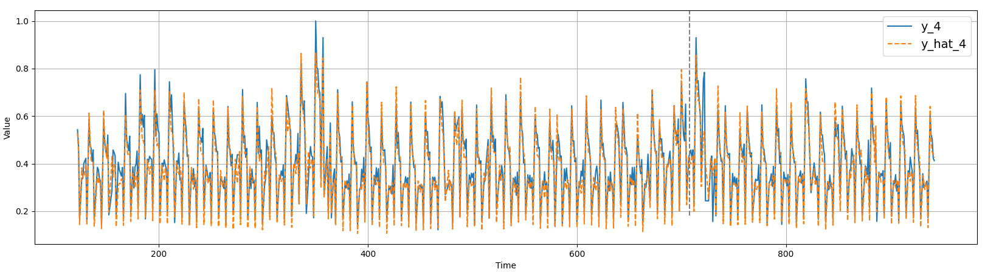
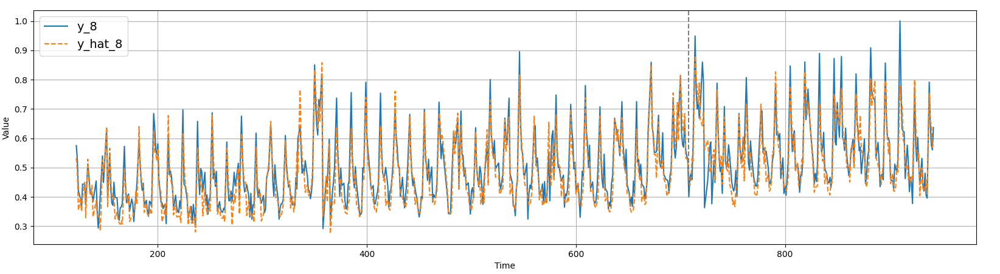

## Time series prediction with RNN 

We train a RNN on the [Rossmann Store Sales dataset
](https://www.kaggle.com/c/rossmann-store-sales)
in order to predict the future store sells.

### Training Logs
To see the logs from the training with tensorboard use:  
```shell script
tensorboard --logdir=${RESULTS_DIR}/logs
```
or within a jupyter notebook:
```
%reload_ext tensorboard
%tensorboard --logdir <logs directory>
```
<br> 



### Setup & Training
```shell script
conda create -n rnn python=3.6
conda activate rnn
pip install -r requirements.txt
python setup.py install
```
Up to now only the CPU execution is tested, the data preprocessing 
has to be optimized. To run a training job execute:
```shell script
# remove --n_stores to use the entire dataset
python exec/train_03.py \
    --data_dir ${DATA_DIR} \
    --model_dir ${RESULTS_DIR}/models_rossmann_03 \
    --log_dir ${RESULTS_DIR}/logs_rossmann_03 \
    --n_stores 4 \
    --num_epochs 201 \
    --store_id_embedding_dim 4 \
    --rnn_hidden_size 32 \
    --rnn_num_layers 4 \
    --batch_size 20 \
    --t_train 708

```
Some notes:  
- The first 708 days are used for training, the remaining days 
until 2015-07-31 are used for validation. 
- The model has a logic that automatically predicts `sales=0` if the 
store is closed (`open=0`).
- A mask makes sure that the predictions for the first 100 days in which
a store is open are not taken into account in the loss function.
